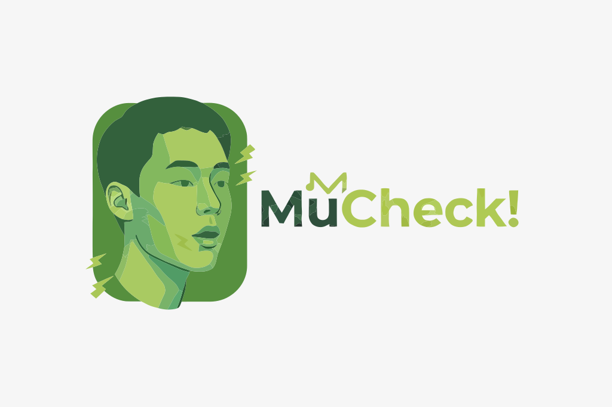

<div align="center">
  
  <br></br>
  <p align="center">
    
    
    
  </p>
</div>

## 소리로 출석을 인증하는, 뮤첵

Sound Stamp는 수업 현장에서 재생 중인 음악을 기반으로 출석을 인증하고, 호스트가 세션별 출석 현황을 관리할 수 있는 웹 서비스입니다.

이 저장소는 Sound Stamp의 프론트엔드 애플리케이션입니다. 게스트/호스트 플로우를 모두 포함하며, 개발 환경에서 MSW 기반 API 모킹을 지원합니다.

## 사용해보기

- 프로덕션 배포 URL은 현재 별도 관리 중입니다.
- 로컬에서 바로 실행해 기능을 확인할 수 있습니다.

## 시작하기

다음 명령어를 입력하여 개발 페이지를 실행합니다.

```bash
yarn
yarn dev
```

[http://localhost:5173](http://localhost:5173)에 접속하여 결과를 확인합니다.

## 협업하기

### 폴더 구조

- `api`
  - API 요청 함수를 정의합니다.
  - 도메인(`auth`, `classes`, `sessions`, `users`, `participation`) 단위로 파일을 관리합니다.
- `components`
  - 공통 UI 컴포넌트와 도메인 컴포넌트를 정의합니다.
- `hooks`
  - 비즈니스 로직과 서버 상태 관리를 위한 커스텀 훅을 정의합니다.
- `layouts`
  - 게스트/호스트 레이아웃을 정의합니다.
- `routes`
  - 페이지(라우트)를 정의합니다.
- `types`
  - API 응답 및 도메인 타입을 정의합니다.
- `utils`
  - YouTube/날짜 관련 유틸 함수를 정의합니다.
- `mocks`
  - MSW(Mock Service Worker)를 이용한 API 모킹 로직을 관리합니다.
  - `db/`: 모킹에 사용되는 기반 데이터(Mock Data)를 정의하고 관리합니다.
  - `handlers/`: 기능/도메인별 API 핸들러를 분리하여 정의합니다.

### 브랜치

- `main`에서 브랜치를 만들어 작업합니다.
- 작업 완료 후 PR을 생성하고 리뷰를 거쳐 `main` 브랜치로 스쿼시 병합합니다.
- `main` 브랜치에 머지되면 GitHub Actions로 빌드/검증이 수행되고, 배포 워크플로(`deploy-client`)가 실행됩니다.
- 브랜치 이름은 `{유형}/{이름}` 형식을 권장합니다.
  - 브랜치 유형: `feat`, `fix`, `chore`, `style`, `refactor`
- PR 제목은 [깃모지](https://gitmoji.dev/) 사용을 권장합니다.

## 🛠 기술 스택

| Category | Technology |
| :--- | :--- |
| **State** | Zustand, TanStack Query |
| **UI & UX** | Tailwind CSS, shadcn/ui, Framer Motion, Lucide React |
| **Routing** | React Router |
| **Networking** | Axios, MSW |
| **Dev Tools** | Vite, Biome, Knip, TypeScript |
| **Deployment** | AWS S3, AWS CloudFront, GitHub Actions |


## 기여자

| [박준영(@young-52)](https://github.com/young-52) | [이준엽(@jun-0411)](https://github.com/jun-0411) |
| :---: | :---: |
| <a href="https://github.com/young-52"></a> | <a href="https://github.com/jun-0411"></a> |
| 랜딩, 로그인, <br> 회원가입, 일정 생성 | 일정 상세, 참여자, <br> 일정 수정, 프로필 수정 |
